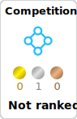
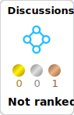

  

<!-- 2. プロフィールや連絡先を変更 -->
##  Hi there

- 🧑‍💻 I'm a aws cloud engineer. 
- 🌱 I’m currently learning golang!
- 📫 How to reach me: [SS@Webエンジニア](https://twitter.com/nNWRPOhv9Z959UH)
 

<!-- 3. 好きな技術スタックに変更 -->
<!-- ライトモート：theme=light, ダークモート：theme=dark -->
<!-- アイコンの選択肢一覧：https://arc.net/l/quote/zizyykfh -->
## 💻 Skills

### ✍️ Learning

 

<!-- 4. GitHub usernameを変更, 2箇所 -->
<!-- ライトモート：theme=light, ダークモート：theme=vue-dark  -->
## 🏃‍♀️ Activities

 
  
  

## Kaggle

       

<!--
This repository is a ✨ _special_ ✨ repository because its `README.md` (this file) appears on your GitHub profile.

Here are some ideas to get you started:

- 🔭 I’m currently working on ...
- 🌱 I’m currently learning ...
- 👯 I’m looking to collaborate on ...
- 🤔 I’m looking for help with ...
- 💬 Ask me about ...
- 📫 How to reach me: ...
- 😄 Pronouns: ...
- ⚡ Fun fact: ...
-->
